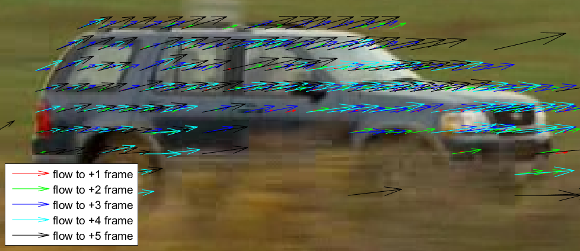

# VOT 2014: Car Exercise

### Youngwook Paul Kwon, UC Berkeley

## Introduction

It was more fun than I expected and many things to think about. The input images of a moving vehicle are from the 2014 Visual Object Tracking Challenge (http://www.votchallenge.net/vot2014/).  I tried to answer the original and the most obvious question: "where is the vehicle given its location in the first frame?." I will also discuss about "what is the pixel-level segmentation of the car in each frame?."

   

## Report

Please see [report.pdf](report.pdf) for detailed information.  Note that the report pdf includes animations. If animations do not work, please let me know.

## Folders

`car` : Input images and ground truth.
`code` : Source codes. You can run `optical_multiple_frame.m` in MATLAB.
`output` : Output images will be saved in this folder. Sub folders are for more visulization. You can ingnore them fow now.
`readme.md` : This file.
`report.pdf` : My report.

## Some results for teaser

### Optical flows

  

### Weighted averaged image, `Palette` 

  

  

  

### Object probability map
This map represents how likely a pixel would be a part of target object. This map is just for visualization and not used to conclude bounding boxes. I expect to improve final bounding boxes by using this information.

  

  

  

## Result
Red and blue bounding boxes represents ground truth and mine, respectively. 

  

