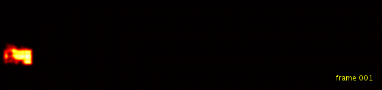

# VOT 2014: Car Exercise

## Introduction

This was my one-week toy project, and was more fun than I expected and many things to think about. The input images of a moving vehicle are from the 2014 Visual Object Tracking Challenge (http://www.votchallenge.net/vot2014/).  I tried to answer the original and the most obvious question: "where is the vehicle given its location in the first frame?." I will also discuss about "what is the pixel-level segmentation of the car in each frame?."

   

I was asked to keep this work confidential, so please understand that I can share only intermediate results. 

## Some results for teaser

### Optical flows

  

### Object probability map
This map represents how likely a pixel would be a part of the target object. Brighter (hotter) pixels represent higher probabaility.

  

Probability map animation :

  

Probability map animation over input video :

  

When the vehicle passes trees, one can see that probabilities get low for occluded parts.
Cool!

