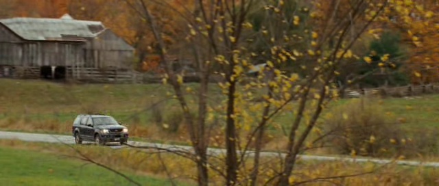
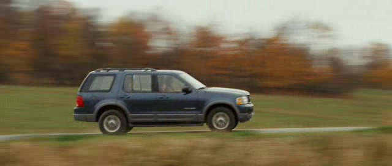

# VOT 2014: Car Exercise

### Youngwook Paul Kwon, UC Berkeley

## Introduction

It was more fun than I expected and many things to think about. The input images of a moving vehicle are from the 2014 Visual Object Tracking Challenge (http://www.votchallenge.net/vot2014/).  I tried to answer the original and the most obvious question: "where is the vehicle given its location in the first frame?." I will also discuss about "what is the pixel-level segmentation of the car in each frame?."

<center>   </center>

## Report

Please see my detailed report [HERE](http://ywpkwon.github.io/uber-assigment).
Or see `report\report.html`. 

## Folders

`car` : input images and ground truth.

`code` : source codes. You can run `optical_multiple_frame.m` in MATLAB.
```` matlab
>> optical_multiple_frame
````

`output` : output images will be saved in this folder.

`report` : algorithm explanation.
